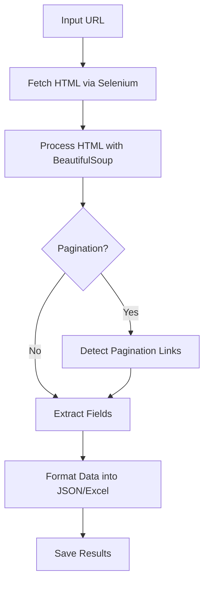

# Universal Web Scraper 🦑

A comprehensive and modular web scraping tool leveraging modern AI models, APIs, and libraries to extract structured data from web pages. This project supports token-based pricing models, pagination detection, markdown conversions, and data formatting for flexible and intelligent web scraping.

## Features

- **Multi-Model Support:** OpenAI GPT models, Google Gemini, Llama3.1, and Groq APIs.
- **AI-Driven Pagination Detection:** Automatically extract and follow pagination links.
- **Structured Data Conversion:** Extract data and format it into JSON or Excel.
- **Streamlit UI Integration:** Simple user interface for scraping setup and monitoring.
- **Customizable Fields:** Dynamically define the data points to extract.
- **Headless Browsing:** Mimics human behavior during scraping for better stealth.

---

## Table of Contents

1. [Setup and Installation](#setup-and-installation)
2. [How It Works](#how-it-works)
3. [Modules Overview](#modules-overview)
4. [Usage](#usage)
5. [Outputs](#outputs)
6. [Contributing](#contributing)
7. [License](#license)

---

## Setup and Installation

### Step 1: Create a Virtual Environment
```bash
python -m venv .venv
source .venv/bin/activate  # On Linux/macOS
.\.venv\Scripts\activate   # On Windows
```

### Step 2: Install Dependencies
Create a `requirements.txt` file with the following libraries and run:
```bash
pip install -r requirements.txt
```

### Dependencies:
- `openai`, `google-generativeai`, `groq`, `selenium`, `beautifulsoup4`, and more.

### Step 3: Environment Variables
Create a `.env` file and add your API keys:
```plaintext
OPENAI_API_KEY=your-openai-api-key
GOOGLE_API_KEY=your-google-api-key
GROQ_API_KEY=your-groq-api-key
```

### Step 4: Download ChromeDriver
[Download the ChromeDriver](https://googlechromelabs.github.io/chrome-for-testing/) that matches your Chrome version and place it in the project directory.

---

## How It Works

1. **Scraper Setup**: Initialize the scraper with a URL, models, and desired fields.
2. **Web Interaction**: Headless browser navigates and interacts with pages.
3. **Data Processing**: Extracts and formats structured data into markdown, JSON, or Excel.
4. **Token & Cost Analysis**: Calculates API token usage and associated costs.
5. **Pagination Detection**: Automatically discovers and navigates through pagination.

---

## Modules Overview

1. **`assets.py`**: Contains configuration constants, pricing details, and model settings.
2. **`scraper.py`**: Core scraping logic and browser interaction methods.
3. **`pagination_detector.py`**: Handles pagination detection and processing.
4. **`streamlit_app.py`**: Streamlit-based UI for managing and visualizing scraping tasks.

---

## Usage

### Run the Streamlit App
```bash
streamlit run streamlit_app.py
```

### Key UI Features:
- **Model Selection**: Choose from supported AI models.
- **URL Input**: Add multiple URLs to scrape.
- **Fields to Extract**: Define the data fields dynamically.
- **Pagination Support**: Enable/disable pagination detection.

---

## Outputs

- **Raw Data**: Markdown files for raw HTML data.
- **Formatted Data**: JSON and Excel files for structured results.
- **Token Usage Report**: Provides input/output token counts and cost analysis.

---

## Example Flow

### Workflow Diagram:


---

## Contributing

Contributions are welcome! Please open an issue or submit a pull request for enhancements.
